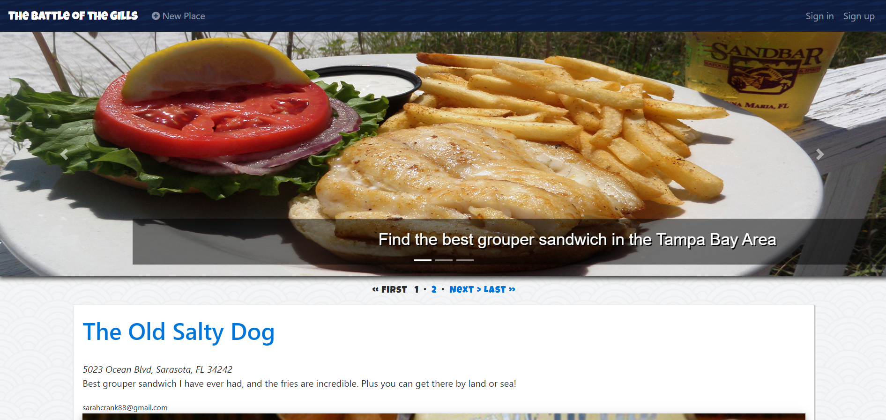

## Battle of the Gills
A Yelp-clone that features a crowd-sourced list of restaurants that serve grouper sandwiched in the Tampa Bay, Florida area. The app integrates with the Google Map API.

### Build status

### Features
* Built on Rails
* Mobile-responsive
* User Authentication: Devise gem
* Picture Uploads: Carrierwave and MiniMagick gems

### Credits
* [The Firehose Project](https://thefirehoseproject.com)
